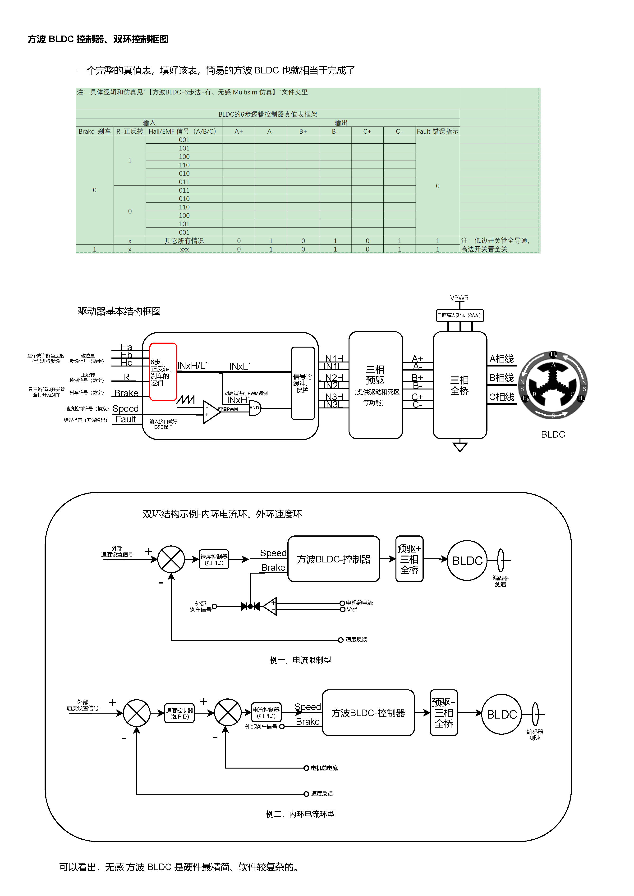
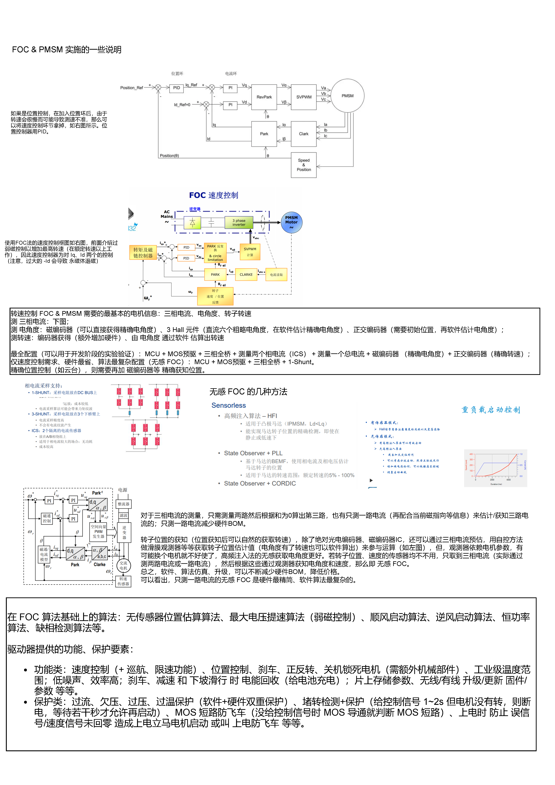
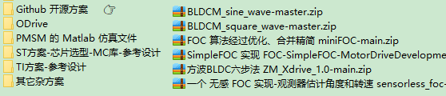

# BLDC 六步法 & PMSM  FOC 法 综合

查阅 n^2 的各方资料，对 BLDC&PMSM 进行一个大综合、大整理，查阅、比较和整理 大量的 网络教程、大厂手册、开源解决方案，在这里形成 原理和解决方案 的打通式介绍。

我的相关项目的开源部分 [iBLDC 项目仓库](https://github.com/Staok/iBLDC)，包括 方案原理的详细介绍、原理图、Multisim 仿真 等丰富资料。本文所分享的资料：

- 搜集大量的教程文档、大厂手册：链接：https://pan.baidu.com/s/1LtJ5qIsCgXu5O3LZAy3UHA 提取码：XHYD （侵删）（497MB）

- 搜集的 大厂方案 + Github 开源项目：链接：https://pan.baidu.com/s/1G76TcIt1bzDZkOVQ3Zhn7A 提取码：XHYL （侵删）（944MB）

------

## 网络教程

- 入门文章，首先看：[无刷电机的工作原理图解 (360doc.com)](http://www.360doc.com/content/19/0613/13/6932394_842187623.shtml)、[【学习】无刷直流电机的基本结构及工作原理_duoduo_bu的博客-CSDN博客_无刷直流电机工作原理](https://blog.csdn.net/duoduo_bu/article/details/96473902)、[无刷直流电机系统基础知识 - 电工基础知识_电工学习网 (diangon.com)](https://www.diangon.com/thread-42532-1-1.html)。
- [BLDC驱动学习_ 啥也不会唉的博客 -CSDN博客_bldc驱动](https://blog.csdn.net/qq_42415953/article/details/111150487)。
- [【自制FOC驱动器】深入浅出讲解FOC算法与SVPWM技术 - 知乎 (zhihu.com)](https://zhuanlan.zhihu.com/p/147659820) 该文对于 BLDC 和 PMSM 的介绍和区别 讲的比较好。
- [ 永磁同步电机控制笔记：foc控制原理通俗讲义_ 搞机的博客 -CSDN博客 _foc原理](https://blog.csdn.net/linzhe_deep/article/details/105849395)。
- 对于两个变换的一些形象演示的动图，比较直观：

  - [FOC中的Clarke变换和Park变换详解（动图+推导+仿真+附件代码）_ GREYWALL-CSDN博客 _clarke变换](https://great.blog.csdn.net/article/details/103672042)。

  - [永磁同步电机控制笔记：clark变换park变换示意图_ 搞电机的博客-CSDN博客 _电流clark变换](https://blog.csdn.net/linzhe_deep/article/details/105162221)。
- 一个 FOC 相关的文章集 [永磁同步电机_搞电机的博客-CSDN博客](https://blog.csdn.net/linzhe_deep/category_9827913.html)。
- 完整展示 SVPWM 的计算过程 [svpwm仿真_ 基于Simulink的SVPWM仿真模块 _weixin_39631689的博客-CSDN博客](https://blog.csdn.net/weixin_39631689/article/details/111106063)。

对于无刷电机的 概念基础知识 和 与 有刷电机的比较：[无刷电机_百度百科 (baidu.com)](https://baike.baidu.com/item/无刷电机/6255414?fr=aladdin)；[(原创）让你真正了解手里的无刷电机 (360doc.com)](http://www.360doc.com/content/16/0824/22/35813754_585692004.shtml)。

> 引自：[无刷电机_百度百科 (baidu.com)](https://baike.baidu.com/item/无刷电机/6255414?fr=aladdin)、[(原创）让你真正了解手里的无刷电机 (360doc.com)](http://www.360doc.com/content/16/0824/22/35813754_585692004.shtml)、[无刷电机基础知识 (360doc.com)](http://www.360doc.com/content/18/0113/13/18790424_721569057.shtml)，摘一些句子，侵删。
>
> 无刷电机优点：低干扰、低噪音、寿命/工作时间长、低维护成本、可控性好、高速、节能、功率密度大等等。其的一些缺点：驱动器成本较高、永磁体不适用于高温、转矩波动等需要控制好（较难）才能用于高性能/低速/位置控制的伺服系统。
>
> 无刷电机的换向模式分为方波和正弦波驱动，就其位置传感器和控制电路来说，方波驱动相对简单、价廉而得到广泛利用。目前，绝大多数无刷电机采用方波驱动，目前市场上的模型电机全部是方波驱动。
>
> 电机的转矩和转速在同一个电机内永远是一个此消彼长的关系，基本可以认为转矩和转速的乘积是一个定数。导体的发热与电流的平方是正比关系，在更高的电压下，如果是同样的功率，电流将下降导致发热减少，使得最大功率增加。这也解释了为什么在专业的航拍飞行器上，大量使用22.2V甚至30V电池来驱动多轴飞行器，高压下的无刷电机，电流小、发热小、效率更高。
>
> **槽极结构 （N：槽数，P：极数）**
> 模型常见的内转子无刷电机结构有：3N2P（有感电机常用）、12N4P（大部分内转子电机）
> 模型常见的外转子无刷电机结构有：9N6P、9N12P、12N8P、12N10P、12N14P、18N16P、24N20P。
> 模型用内转子无刷电机极数不高的原因：目前内转子电机多用于减速使用，所以要求的转速都比较高。电子（电角度）转速=实际转速*电机极对数，电子控制器支持的最高电子转速往往都是一个定数，所以如果电机极对数太高的话，支持的最高电机转速就会下降，所以目前的内转子电机极数都是4以内。
> 关于12N4P内转子电机：属于整数槽电机，大量使用于模型内转子电机，电机使用单层绕组分布绕线。
> 模型用外转子电机都是分数槽电机，其结构特点和性能如下：
>
> - N必须是3的倍数，P必须是偶数（磁钢必须是成对的，所以必须是偶数）。
> - P数越小，最高转速越高。例如12N10P的最高转速肯定低于12N16P，反之亦然。
> - N比P大，则相对转速更高。9N6P最高转速肯定高于9N12P，反之亦然。
> - 同样的N，P越大扭力越强。扭力，12N16P大于12N14P大于12N10P。
> - N和P之间不能整除，比如12N6P。
>
> 外转子槽极结构与应用领域：9N6P减速使用于400-500级别的直升机模型以及小型涵道、9N12P直驱使用于小型固定翼或者其他模型、12N8P减速使用于500-700直升机模型或者直驱使用于中大型涵道、12N10P减速使用于600-800直升机模型、12N14P直驱使用于大部分固定翼和船模，高于12槽结构的无刷电机多见于多轴飞行器。
>
> **有感电机与无感电机**（即有、无传感器的）
>
> 有感电机的优势：运转精度高、启动平稳
>
> 有感电机的劣势：
>
> - 在高温、振动等条件下由于传感器的存在使系统的可靠性降低。
> - 传感器连接线多不便安装、易引起电磁干扰。
> - 传感器的安装精度直接影响电机运行性能，特别是在多极电机安装精度难以保证。
> - 占用空间，限制电机小型化。
>
> 无感电机的优点：结构简单、成本较低、安装方便
>
> 无感电机的缺点：转子位置检测精度降低，运转精度降低，启动不如有感电机平稳。
>
> 什么是有感电机：传统的无刷电机都安装有霍尔传感器，利用霍尔传感器检测转子位置实现转向。
>
> 什么是无感电机：去除霍尔传感器，利用电子控制器检测电机的反电动势变化从而确定转子位置实现转向。
>
> **外转子无刷与内转子无刷**
>
> 外转子无刷电机的优点：转动惯量大、转动平稳、转矩大、磁铁好固定。
>
> 外转子无刷电机的缺点：定子热量无法排出、内部工作环境部封闭，外部杂物可能进入电机内部影响运转。
>
> 内转子无刷电机的优点：绕组与外壳直接接触，热量可直接排出，电机内部与外部隔绝，避免外部杂物进入内部。
>
> 内转子无刷电机的缺点：扭矩不如外转子无刷电机、磁铁固定较为复杂。

搜集大量的教程文档、大厂手册：

链接：https://pan.baidu.com/s/1LtJ5qIsCgXu5O3LZAy3UHA 提取码：XHYD  --来自百度网盘超级会员V4的分享（侵删）（497MB）

## 原理详解

高清原图在 [iBLDC 项目仓库](https://github.com/Staok/iBLDC) 内可下载。

### 方波 BLDC 六步换向法

### 方波 BLDC 控制器实施

### 正弦波 PMSM FOC 法

### FOC 算法实现细节

### 正弦波 PMSM 控制器实施

## 未来需求

关于未来无刷电机驱动的技术满足要求（p.s 画饼什么的，最快乐了），这是美国能源部的数据，如下表，主要是针对汽车应用：

我的无刷电机驱动板子（[iBLDC](https://github.com/Staok/iBLDC)），尺寸在 3cm * 4cm * 1cm，按照上图来讲，2020年要达到高于 94% 效率，并且功率大于160W（远已经达到），2025年要达到1200W，效率要高于98%。

另外，这个表的成本要求非常高；还有提高频率来减小器件体积封装，先进封装，提升散热效率等；更先进的门机驱动提升安全性，完善的保护电路；采用更鲁棒的算法。

## 方案收集

搜集的 大厂方案 + Github 开源项目：

链接：https://pan.baidu.com/s/1G76TcIt1bzDZkOVQ3Zhn7A 提取码：XHYL  --来自百度网盘超级会员V4的分享（侵删)（944MB）

### 大厂库

#### infineon

电机控制芯片选型：[电机控制芯片 - Infineon Technologies](https://www.infineon.com/cms/cn/product/power/motor-control-ics/)。

英飞凌有一些 带 MOS 预驱的 M3 MCU 选型，如 [集成 Arm® Cortex® M3 的 3 相桥式驱动器 - Infineon Technologies](https://www.infineon.com/cms/cn/product/microcontroller/embedded-power-ics-system-on-chip-/3-phase-bridge-driver-integrated-arm-cortex-m3/)，另还有许多 BLDC 电机评估版，并配套了 软件库 等全套东西，比如 [BLDC_SHIELD_TLE9879 - Infineon Technologies](https://www.infineon.com/cms/cn/product/evaluation-boards/bldc_shield_tle9879/)。

#### TI

TI 电机驱动器 选型：[无刷直流 (BLDC) 驱动器 | 概述 | 电机驱动器 | 德州仪器 TI.com.cn](https://www.ti.com.cn/zh-cn/motor-drivers/brushless-dc-bldc-drivers/overview.html)。

搜索 TI 的参考设计库，有非常丰富的 BLDC&PMSM 参考设计，原理图、软件库均公开：[TI 参考设计库：BLDC](https://www.ti.com.cn/cn/reference-designs/index.html#search?keyword=BLDC)。

评估板 的软件包 和 FOC 算法软件 具体在每一个 BLDC&PMSM 参考设计页面均提供下载。

> 可以使用 其 IQmath 库：[基于STM32实现SVPWM调制算法 - 知乎 (zhihu.com)](https://zhuanlan.zhihu.com/p/358420266)；[基于C语言的Q格式使用详解 - 知乎 (zhihu.com)](https://zhuanlan.zhihu.com/p/359136874)；

#### ST

ST 的无刷直流电机驱动选型：[无刷直流电机驱动器 - STMicroelectronics](https://www.st.com/zh/motor-drivers/brushless-dc-motor-drivers.html)。

评估板：[3相6步控制 - STMicroelectronics](https://www.st.com/zh/applications/industrial-motor-control/3-phase-6-step-control.html#hw-evaluation-tools)；[三相磁场定向控制FOC - STMicroelectronics](https://www.st.com/zh/applications/industrial-motor-control/3-phase-field-oriented-control-foc.html#hw-evaluation-tools)。

运动和驱动解决方案：[运动和驱动解决方案 - STMicroelectronics](https://www.st.com/zh/solutions-reference-designs/industrial-motor-control-solutions.html#products)。

ST 的 电机软件库 使用 ST MCSDK，其作为 X-CUBE-MCSDK 部件，其自带 上位机界面 进行曲线查看和参数调试等。下载页面 [X-CUBE-MCSDK - STM32电机控制软件开发套件（MCSDK） - STMicroelectronics](https://www.st.com/zh/embedded-software/x-cube-mcsdk.html)，其更多文档下载 [stmcu.com.cn X-CUBE-MCSDK 页面](https://www.stmcu.com.cn/ecosystem/app/Motor-control)，更多培训视频 [基于MC SDK V5.4电机库的STM32电机控制理论与实践-电堂科技 (51diantang.com)](https://c.51diantang.com/columndetail?id=126b8417f88949799f4caf99e98e2ee1)、[STM32电动机控制应用系列讲座-电堂科技 (51diantang.com)](https://c.51diantang.com/columndetail?id=2ab86a9228814c09a9621d3a970b21ac)、[STM32 TALK (电机控制私享会)-电堂科技 (51diantang.com)](https://c.51diantang.com/columndetail?id=c1de7395091c4524ab7cbe2ea56cc982)。

ST MCSDK 网络文章教程：

- [STM32G4板卡分享—STM32G4在电机控制中的应用 - 知乎 (zhihu.com)](https://zhuanlan.zhihu.com/p/97748533)。
- [如何拷贝工程_工程师笔记 | 如何结合STM32CubeMX与MC Workbench生成修改未包含的芯片程序..._喵仔冲鸭的博客-CSDN博客](https://blog.csdn.net/weixin_35282085/article/details/112738615)。
- [type=file 把默认的未选择文件换成别的_工程师笔记：如何结合STM32CubeMX与MC Workbench生成修改未包含的芯片程序..._weixin_39630247的博客-CSDN博客](https://blog.csdn.net/weixin_39630247/article/details/111681443)。

> 对于 STM32 F4 的 DSP 和 一些 数学函数 的使用，使用 CMSIS 的 DSP，可以参看 **安富莱** 对于 STM32 DSP 的丰富教程。 

### 开源项目

选择一个去看手册和源码去实现即可。

- 国内做 BLDC&PMSM 教程开发板的，举例两家 **硬石** 和 **匠心**，淘宝搜即可，前者资料开源，后者的资料其实也 被 “开源了”。

- ODrive：官网 [ODrive (odriverobotics.com)](https://odriverobotics.com/)；[odriverobotics/ODrive: High performance motor control (github.com)](https://github.com/odriverobotics/ODrive)；[madcowswe/ODriveHardware: High performance motor control (github.com)](https://github.com/madcowswe/ODriveHardware)。

- VESC（国内常称 “本杰明方案”）：[VESC Project (vesc-project.com)](https://vesc-project.com/)；[vedderb/bldc: The code for my custom BLDC controller. (github.com)](https://github.com/vedderb/bldc/)；[vedderb/bldc-hardware: Brushless DC Motor controller from Benjamin Vedder (github.com)](https://github.com/vedderb/bldc-hardware)；[vedderb/bldc-hardware: Brushless DC Motor controller from Benjamin Vedder (github.com)](https://github.com/vedderb/bldc-hardware)。

  基于VESC的衍生开源项目 举例：

  - [shamansystems/Cheap-FOCer-2: Low-Cost Motor Controller based on the VESC 6 (github.com)](https://github.com/shamansystems/Cheap-FOCer-2)；
  - [aramaerospace/Micro-VESC-6: Micro VESC-6 (github.com)](https://github.com/aramaerospace/Micro-VESC-6)；
  - BMS [mpater/bldc-BMS: Battery management system for a VESC (github.com)](https://github.com/mpater/bldc-BMS)；[vedderb/vesc_bms_fw: The VESC BMS Firmware (github.com)](https://github.com/vedderb/vesc_bms_fw)。

- SimpleFOC：[Home | Arduino-FOC (simplefoc.com)](https://docs.simplefoc.com/)。

  - 中文网页手册 [simplefoc/docs_chinese: SimpleFOC docs website translated to Chinese (github.com)](https://github.com/simplefoc/docs_chinese)；
  - [simplefoc/Arduino-FOC: Arduino FOC for BLDC and Stepper motors - Arduino Based Field Oriented Control Algorithm Library (github.com)](https://github.com/simplefoc/Arduino-FOC)；
  - < 5A 版本：[simplefoc/Arduino-SimpleFOCShield: Arduino Shiled for running Gimbal BLDC motors with FOC algorithm (github.com)](https://github.com/simplefoc/Arduino-SimpleFOCShield)；
  - < 30A 版本：[simplefoc/Arduino-SimpleFOC-PowerShield: A powerful Arduino shield for running BLDC motors using the FOC algorithm (github.com)](https://github.com/simplefoc/Arduino-SimpleFOC-PowerShield)。

- 更多开源项目：

  - FOC 算法经过优化、合并精简的一个自实现：[ZhuYanzhen1/miniFOC: 你还在为有刷电机的高噪声、低响应速度和低寿命而烦恼吗？这个项目是一个20块钱就能搞定的FOC无刷电机控制方案！This project is a FOC (Field Oriented Control) BLDC Motor control scheme that can be done for 3$! (github.com)](https://github.com/ZhuYanzhen1/miniFOC)。

  - 一个 无感 FOC 实现：[NYCParker/sensorless_foc: 电机驱动开发项目：sensorless_foc (github.com)](https://github.com/NYCParker/sensorless_foc)。

  - 使用 ST MCSDK 库生成工程：[dtltljb/FOC-MOTOR-CONTROLLER: 基于STM32有感直流无刷电机驱动控制程序，集成CANopen通讯电机控制子集协议 和 MONDBUS 协议。 (github.com)](https://github.com/dtltljb/FOC-MOTOR-CONTROLLER)。

  - 一个 C++ 实现 FOC：[BetzDrive/bldc-controller: Motor controller firmware! (github.com)](https://github.com/BetzDrive/bldc-controller)；硬件：[BetzDrive/bldc-controller-hardware: Hardware design files for BLDC servo controller (github.com)](https://github.com/BetzDrive/bldc-controller-hardware)。

  - 基于Hall估计角度的FOC，Matlab仿真并生成c文件的方案：FOC 算法的 Matlab 仿真 [EFeru/bldc-motor-control-FOC: Field Oriented Control (FOC) for BLDC motors (github.com)](https://github.com/EFeru/bldc-motor-control-FOC)；FOC 仿真后部署在 板子上 [EFeru/hoverboard-firmware-hack-FOC: With Field Oriented Control (FOC) (github.com)](https://github.com/EFeru/hoverboard-firmware-hack-FOC)。

  - SimpleFOC 实现 [ChenDMLSY/FOC-SimpleFOC-MotorDriveDevelopmentBoard: drive a brush motor，drive brushless motor (github.com)](https://github.com/ChenDMLSY/FOC-SimpleFOC-MotorDriveDevelopmentBoard)；

    方波BLDC六步法 [ChenDMLSY/ZM_Xdrive_1.0: 该驱动板支持：霍尔无刷驱动、感应电动势无刷驱动、simpleFOC、直流减速电机改舵机，多样性功能，性价比高 (github.com)](https://github.com/ChenDMLSY/ZM_Xdrive_1.0)。

  - [zhutongwen/BLDCM_square_wave: 无刷直流电机方波驱动程序，stm32f4驱动两个无刷电机 (github.com)](https://github.com/zhutongwen/BLDCM_square_wave)；[zhutongwen/BLDCM_sine_wave: 有感无刷直流电机驱动程序，一个stm32同时驱动两个无刷电机，正弦波驱动 (github.com)](https://github.com/zhutongwen/BLDCM_sine_wave)。

