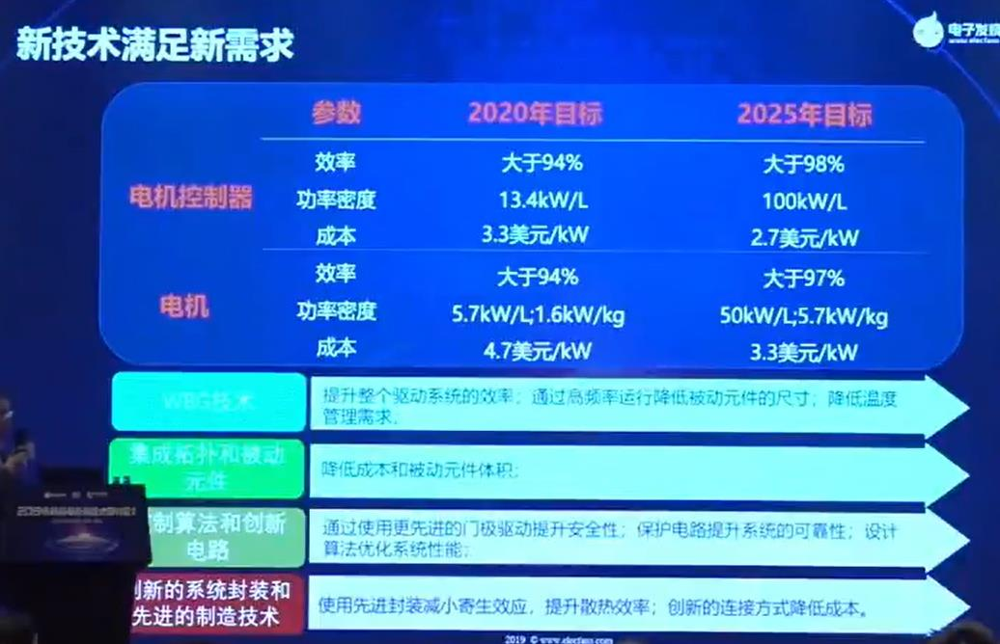

# 大方向选择-画饼文章

*p.s 画饼什么的，最快乐了*

------

## 2021.4.25留言

目前做的 iBLDC 的 STM32F405 版本是验证版本，它可以验证 BLDC 有感、无感和 FOC 有感，共三种驱动模式。

当算法都固定下来后，往后的硬件廉价化和最小简化：

-  有感 FOC：计算量大，用 STM32 F4 最便宜的一款实现；
- 有、无感 BLDC：可采用 STC15 系列 超廉价 MCU 实现，软件上可以通过设置切换有感还是无感模式，具体软硬将仿“STC15W401AS-实现四轴飞行器无刷电机的电调控制-参考程序和电路.ZIP”。

## 2021.4.4 留言

关于未来无刷电机驱动的技术满足要求，这是美国能源部的数据，如下表，主要是针对汽车应用：

按照此表，我的无刷电机驱动板子，尺寸在 3cm * 4cm * 1cm，按照上图来讲，2020年要达到高于 94% 效率，并且功率大于160W（已经达到），2025年要达到1200W，效率要高于98%。

另外，这个表的成本要求非常高；还有提高频率来减小器件体积封装，先进封装，提升散热效率等；更先进的门机驱动提升安全性，完善的保护电路；采用更鲁棒的算法。

## 2020.12.1 最新留言

关于无刷电机驱动板子，自己用drv8302设计第一版，造价控制在50以内，算法和软件就学习下载的资料（入门足矣），别买了，买的话就不能走整个流程了。电机板子第一版可以画大一点，5x10cm即可，另外一半留给电源板子，成熟后画超级超级小的，造价控制在30以内，如果能以学习的目的卖，标价100，淘宝普遍标价250以上，真tm割韭菜，高价收小白学费，我这个项目就是来打价格战的！

## 2020.11.22 最新留言

无刷电机分类：

BLDC：直接给方波换向

-   有感：带磁编码或者HALL得到电角度，MCU给换向方波
    -   MCU软件实现：必须带的：位置检测（磁编码或者HALL，总之就是得到电角度，不是机械角度哦！）；一路总电流，用于电流闭环（必做，外置MOS大功率）
    -   硬件芯片实现：（找内和外置MOS的方案，即功率有小和大可以选）

-   无感：检测过零电动势估计到电角度，MCU给换向方波
    -   MCU软件实现：一路总电流，用于电流闭环（必做，外置MOS大功率）
    -   硬件芯片实现：（找内和外置MOS的方案，即功率有小和大可以选）

PMFS：FOC算法

-   有感 MCU软件实现：（必做，外置MOS大功率，自己实现FOC算法）
    -   FOC算法（svpwm在网上csdn,gitee,Github找一找源代码参考；尽量用独立实现的代码，不用ST电机库什么的，太大）
    -   必须带的：位置检测（磁编码或者HALL，总之就是得到电角度，不是机械角度哦！）；至少两路电流值

-   有感 硬件芯片实现：（找几个芯片方案文档即可，这种芯片太贵）。集成了FOC算法的芯片直接用。

## 最早的留言（2020.9以及之前）

-   先BLDC有感（霍尔，或者磁编码器），然后BLDC无感（只三根线UWV），然后有感FOC
-   上面说的都是带MCU的，不带MCU的当搞明白HALL和给PWM的关系以及反电动势的时候直接就能设计了，所以不着急。
-   纯粹的只做一块块BLDC驱动板，不加额外IC和功能，专注一些，也减少空间占用。
-   BLDC后期开发四种：一种用MCU实现检测HALL换向逻辑，或者检测反电动势实现换向逻辑；另一种用纯硬件实现检测HALL换向逻辑或者纯硬件检测反电动势实现换向逻辑。这四种：均要求像上面小型化电源一样，超级小，电流至少10A级别，并配有10A恒流保护，12A过流断开