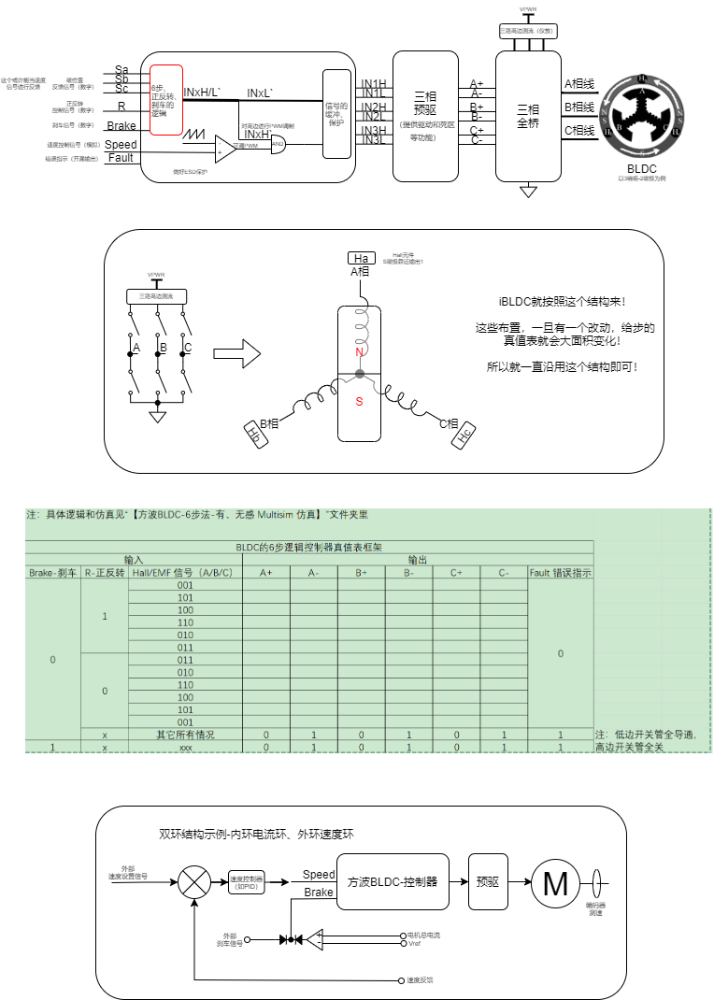
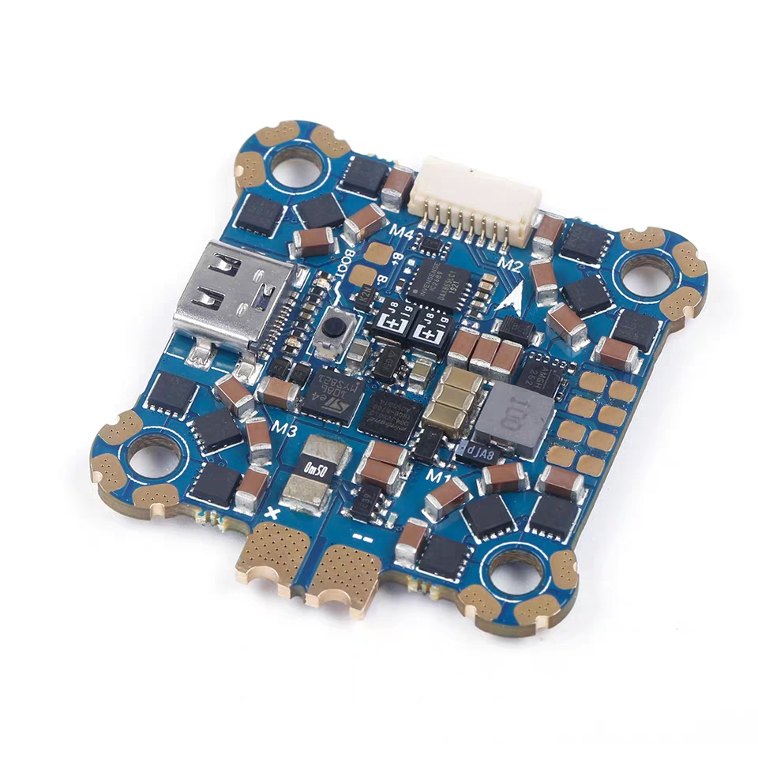

# 无刷直流电机(BLDC)驱动器方案敲定稿

*p.s 本文为根据《大方向选择-画饼文章.ms》一文来选择和敲定方案。*

------

## 器件选型注意！

-   贴片电容：X7R/X5R材质，100V耐压及以上。
-   MOS选用 CSD 贴片系列（型号与powerbar上的同样）（或者再在英飞凌官网上筛选筛选）。
-   AD规范，对齐“通用电源模块”的原理图，所有图纸用A4。
-   对于 6 N-MOS 预驱的选择，目前的学习、实验板为使用 DRV8302（参考“本杰明”的电路以及官网的经验手册）；最大 60V，针对 36V~48V 应用；DRV8302（集成两个电流检测运放和一个高达1.7A的BUCK），用这个BUCK做MCU系统供电；如果相中830x系列，就用8302，不用看他的兄弟8301、8303和8304等，我看了，只有细节变化，8302功能足够。若代码/方案成熟，后续可以选择更廉价、小巧、功能更全的预驱（比如可选FD6288（参考和对标现有的“四合一模块”产品），封装比较小，如果有更合适的还可以再选）！

## 方波方案

分为带MCU的有感和无感、纯数字逻辑电路的有感和无感（有感和无感的区别是前者用三路 HALL 元件感知磁位置，后者用 EMF（反电动势）方式（电机三线电阻分压后与中点电压比较得出磁位置波形，该波形与 三路 HALL 元件测出的基本一致 ）感知磁位置（无感只需电机的三根线），所以方波的有感和无感区别只在磁位置感知上，其它的数字逻辑均一致（简单的来说））。

高压/低压版本的区分主要在于 功率板部分（6 N-MOS + 预驱 的板）的不同（预驱选型、MOS 选型、阻容选型等），而控制板部分（MCU或纯数字电路）都是 5V/3.3V 电压域的，所以功率板部分与控制板部分可以分为三个板，一个控制板、一个低压的功率板和一个高压的功率板。

要注意，为了控制板的比较大的兼容性，可以进行功能设置。比如输出 6 PWM（直接控制 6 MOS）或 3 PWM（给预驱）；控制板自带 6个 sot23 封装的 N-MOS（20V/3A 能力）可以直接外接 小 BLDC 转起来；...

（2021.11.23~27）对于方波BLDC-六步法，方案基本形成，如下。（关于真值表，就按照 “无刷直流电机控制电路的Multisim设计实训.pdf” 里面的即可，该论文里的 BLDC 结构即下图，拿下图这个作为 iBLDC 的结构并根据这个结构得出六步法真值表）

### 带 MCU 的有感/无感

说明：由 MCU 产生控制波形，并在 MCU 内实现调速等更多功能。

进度：

- 电路设计完毕，使用目前的 iBLDC 原理图和电路板。
- 程序要使用DSP相关的库加速计算；核心计算程序要固定（方便移植）。

特别的：

带 MCU 方波无感 低压大电流版本，这个版本就是仿小四轴电调产品，针对 30V 以下应用；超小型化（参考四合一小型四轴驱动模块），一个小模块只做一路就行了，但是要小，差不多是下图的亚子。

### 纯数字电路的有感/无感

说明：纯数字电路能够提供 BLDC 转起来的基础，引出调速、转向、转速等输入输出接口，若要完成智能功能还需要再加 MCU。

进度：

- 电路有待设计。先把6步的真值表正确的搞定（正反转）。

------

## 正弦波方案

带 MCU，实现 FOC 的有感和无感。

### FOC 有感

一些积累说明：

- 三电阻和单电阻可以用跳线帽切换。

进度：

- 电路设计完毕，使用目前的 iBLDC 原理图和电路板。
- 开始学习和涉及的时候进行原理的记录。
- 程序要使用DSP相关的库加速计算；核心计算程序要固定（方便移植）。

### FOC 无感

最后攻克。

